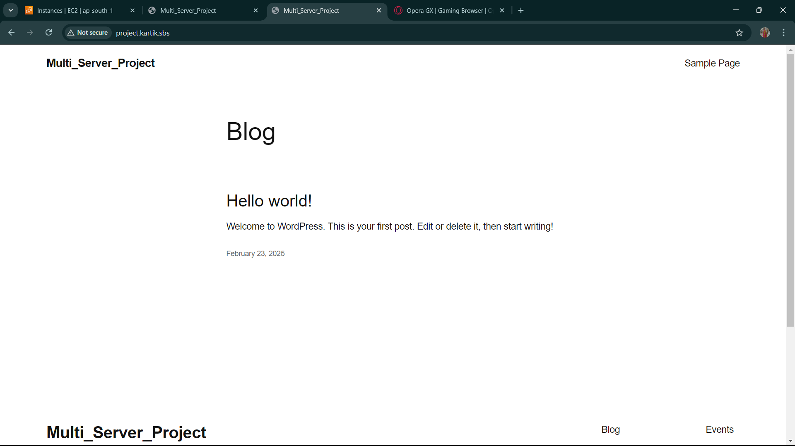

# Multi-Server Architecture with DNS, WordPress, Database Replication & NFS

## 📌 Project Overview
This project demonstrates the implementation of a **Multi-Server Infrastructure** by integrating **DNS, NFS, Web Server (WordPress), and MariaDB (Master-Slave replication)** to create a **scalable, redundant, and high-availability** system.

## 🎯 Objective
To design and deploy a **multi-server architecture** ensuring:
- **Centralized storage** using NFS.
- **Database replication** for redundancy and high availability.
- **Seamless web hosting** with WordPress.

## 🏗️ Project Scope
The architecture consists of multiple servers, each assigned specific roles:
- **Instance 1 (DNS Server)** - Resolves domain names to IP addresses.
- **Instance 2 (NFS Client + Web Server + Virtual Hosting)** - Hosts WordPress and connects to the database.
- **Instance 3 (Master Database Server)** - Stores and replicates data.
- **Instance 4 (Slave Database Server)** - Ensures database redundancy.

## ⚙️ Functional Components
### ✅ **DNS Server**
- Configured to resolve `kartik.sbs` to `Public IP of Instance 2`.
- Ensures proper hostname resolution for all servers.

### ✅ **NFS Server**
- Provides shared directories:
  - `/nfsserver` → Mounted at `/var/www/html/nfsclient` (Web Server) for WordPress files.
  - `/db-data-server` → Mounted at `/var/lib/mysql/db-data-client` (Master DB Server) for MariaDB storage.

### ✅ **Web Server** (Apache/Nginx + PHP + WordPress)
- Installed and configured **Apache/Nginx** with PHP support.
- Mounted **NFS shared directory** (`/nfsserver`) to store WordPress files.
- Installed and set up **WordPress** with a database connection.

### ✅ **Database Server** (MariaDB Master-Slave Replication)
- Installed **MariaDB** on both Master and Slave servers.
- Configured **Master-Slave replication** for data consistency.
- Mounted **NFS storage** (`/db-data-server`) for centralized database storage.

## 🚀 Key Implementations
✔ **Multi-Instance Deployment** - DNS, WordPress, MariaDB, and NFS distributed across multiple servers.

✔ **AWS Public IP Usage** - Configured AWS EC2 instances with public IPs for external accessibility.

✔ **Security Optimization** - Defined firewall rules and access control for secure communication.

✔ **Database Replication** - Configured MariaDB **Master-Slave setup** for failover protection.

✔ **NFS Integration** - Ensured centralized storage management across the infrastructure.

✔ **Virtual Hosting & Testing** - Hosted `project.kartik.sbs` and verified accessibility.

## 🎯 Expected Outcomes
✅ **Scalable & redundant** architecture for seamless web hosting.

✅ **Centralized storage management** for efficient resource utilization.

✅ **Reliable database replication** ensuring high 
availability.

✅ **Hands-on experience** in cloud infrastructure and multi-server deployment.

## 🔗 Technologies Used
- **Cloud Provider**: AWS (EC2 Instances, Security Groups)
- **Operating System**: Linux (Ubuntu/CentOS)
- **Web Server**: Apache/Nginx
- **Database**: MariaDB (Master-Slave Replication)
- **DNS**: BIND
- **Storage**: NFS
- **Security**: Firewall, SSH, Access Control

## 🎓 Learning & Takeaways
This project provided deep insights into **Cloud Computing, DevOps, Networking**, and **Multi-Server Configuration**. The hands-on experience in setting up a **fault-tolerant system** was invaluable! 🚀

---

### Deployed Website 📸:
-> Website With Virtual Hosting on (project.kartik.sbs)

## 📌 **Connect with Me**  
- Stay updated on [LinkedIn](https://www.linkedin.com/in/-kartikjain/) to see more projects and continuous improvements as I advance on this exciting journey. 
- Follow along to track my daily progress and solutions as I tackle challenging **DevOps Projects**, master new tools, and refine my skills.  
- Let’s collaborate and build impactful **DevOps solutions** together!

